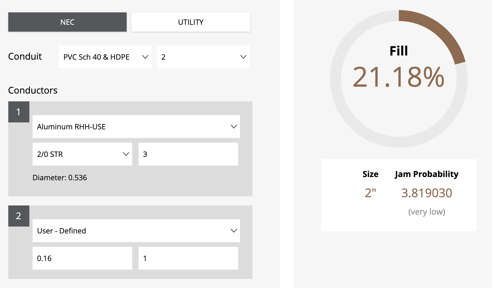

## Table of contents

- [1. Brief Summary of Work](#brief-summary-of-work)

- [2. Materials](#materials)

	- [2.1 Main Panel](#main-panel)

	- [2.2 Feeder Breaker](#feeder-braker)

	- [2.3 Sub Panel & Accessories](#sub-panel-and-accessories)

	- [2.4 Feeder cables](#feeder-cable)

	- [2.5 Circuit Breakers](#breakers)

	- [2.6 Romex Cables](#romex-cables)

	- [2.7 Conduit](#conduit)

	- [2.8 Electrical Boxes](#electrical-boxes)

- [3. Working Plan](#working-plan)

	- [3.1 Install Conduit](#install-conduit)
	- [3.2 Install Sub-Panel](#install-sub-panel)
	- [3.3 Pull Cables Through Conduit](#pull-cables-through-conduit)
	- [3.4 Draw Individual Circuits](#draw-individual-circuits)
	- [3.5 Rough-In Inspection](#rough-in-inspection)
	- [3.6 Make Final Connections](#make-final-connections)
	- [3.7 Final Inspection](#final-inspection)

    

## 1. Brief Summary of Work

- Install a 125 Amp sub-panel in the same building as the existing main panel (also rated at 125 Amp). The sub-panel will be located inside the building, about 40 feet away.

- Remove existing kitchen circuits from the main panel

- Install following new kitchen circuits (**total 8**) to be fed from the sub panel, all rated at 20 Amp, protected by dual AF/GF breakers

	- Lighting circuit (x1)
	- Appliance circuit including refrigerator and gas-fired range (x2)
	- Microwave (x1)
	- Dishwasher (x1)
	- Garbage Disposal (x1)
	- Gas furnace (x1)
	- Range hood (x1)

 

 

 
	

## 2. Materials

 

### 2.1 Main Panel & Accessories

- Main panel is Eaton Cutler-Hammer series BR-type panel with a 125 Amp main breaker. It has 20 spaces, of which 17 are currently in use.  Following kitchen circuits are present. Garbage disposal and dishwasher currently share the #3 circuit below, which is not up to current code.

1. Furnace
2. Electric range
3. Fridge & appliance outlets
4. Counter outlets

- Since the kitchen is being remodeled (new floors and new cabinets), all old circuits (outlets and wires) will be removed and new up-to-code circuits will be installed as described in the brief summary above.

- To attach the ``2/0 Al`` (neutral) feeder wire to the neutral/grounding bus in the main panel, a neutral lug kit [Eaton NL20](https://www.homedepot.com/p/Eaton-125-Amp-Neutral-Lug-NL20/100198084) rated at 125 Amp will be used.

 

### 2.2 Feeder Breaker

- A new 125 Amp feeder breaker - [Eaton BR2125 2-Pole](https://www.eaton.com/us/en-us/skuPage.BR2125.html) - will feed the proposed sub-panel. Breaker terminals are rated at 60C and 75C.

 

### 2.3 Sub Panel and Accessories

- Square-D QO series load center [QO142M200PQCVP](https://www.se.com/us/en/product/QO142M200PQCVP/load-center%2C-qo%2C-1-phase%2C-42-spaces%2C-52-circuits%2C-200a-convertible-main-breaker%2C-pon%2C-nema1%2C-qwik-grip%2C-value-pack/) will be used as sub-panel operating at a maximum of 125 Amps.

- The main breaker in this panel is rated at 200 Amps and it will be used simply as a disconnect.

- There are a total of 40 places in this panel for full sized breakers.

- Bonding screw (which bonds neutral/grounding bus to the panel chassis) **will not be installed**. Instead the existing buses will be used as ``Neutral`` and a separate ``Grounding bus`` will be used for grounding purposes. This complies with the requirement to keep neutral and ground separate in sub-panels.

- Grounding bus to be used is [Square-D PK23GTA](https://www.se.com/us/en/product/PK23GTA/load-center-accessory%2C-qo-homeline%2C-ground-bar-kit%2C-23-terminals/). Two such buses will be used. Both will be bonded to each other as well as to the sub-panel chassis.

- To attach neutral feeder wire to neutral bus and grounding wire to the isolated grounding bus (bonded to panel chassis), the [Square-D Neutral Lug Kit LK150AN](https://www.se.com/us/en/product/LK150AN/load-center-accessory%2C-qo-homeline%2C-lug-kit%2C-neutral%2C-150a%2C-awg-2-3-0%2C-aluminum-or-copper/) will be used.  This lug which is rated at 150 Amps exceeds the minimum requirement of 125 Amps.

 

### 2.4 Feeder Cables

- Individuals conductors will be used to feed the subpanel via PVC conduit. 

- These conductors are being chosen using the NEC2020 **Article 310**, **Table 310.16** (Allowable Ampacities of Insulated Conductors).

	- Current carrying conductors (2 hots, 1 neutral): [Southwire Model #27285699](https://www.southwire.com/wire-cable/building-wire/aluminum-rhh-rhw-2-use-2-with-alumaflex-brand-conductors/p/BW17) Aluminum 2/0 with insulation classified as RHH, RHW-2 and USE-2 rated at 75C to carry 135 Amperes. 

	- Grouding conductor will be [Southwire Model #10638592](https://www.southwire.com/wire-cable/copper-bare-covered/bare-copper-wire-and-cable/p/CUBARE7) 6 AWG Solid Bare Copper. Cable diameter is 0.162 inches (or 162 mils).

- In the conduit fill calculation below, the ``User - Defined`` wire is the grounding 6 AWG wire with a diameter of 0.162 inches.

 

 

 

### 2.5 Circuit Breakers

- All 8 planned circuits will be rated to 20 Amps and will be protected by dual function AFCI/GFCI circuit breakers

- All breakers will be [Square-D QO120PDFC](https://www.se.com/us/en/product/QO120PDFC). These breakers are PLUG-ON style compatible with the chosen sub-panel.

 

### 2.6 Romex Cables

- Planned circuits will be fed from the sub-panel using [Southwire SIMPULL 12/2 Romex Cable]()

 

### 2.7 Conduit

- Schedule 40 PVC conduit of size 2" will be be used to run the feeder cable from main panel to sub panel. 

- Part of the run will be on the outside wall where the main panel is located. The rest of the run will be either in attic space or in the crawlspace, depending upon which method is most convenient.

- Conduit will be fully secured to the external wall using clamps and to the joists and studs when running through attic/crawlspace.

- To account for wide variation in seasonal temperatures, **expansion fittings** will be used to allow the PVC pipe to expand and contract without breaking and exposing cables.

 

### 2.8 Electrical Boxes

- **Outlet/Switch Boxes**: Since studs will be fully accessible, new-work plastic boxes will be installed for all 8 circuits.

- **Junction Boxes**: Only metal junction boxes will be installed which will be fully grounded. These boxes will be in both the attic and the crawlspace and will remain  fully accessible.

   

## 3. Working Plan

The subpanel and circuit installation will proceed in the following phases:

 

### 3.1 Install Conduit

- SCH40 PVC Conduit (2 inch internal diameter) will be installed at the side-bottom left knockout on the main panel.

- The conduit will run approximately 10 feet over the wall until it reaches the point where it can enter crawl space.

- Conduit will then continue through the crawlspace towards the utility room next to the kitchen.

- Conduit will terminate under the bottom plate where the feeder cable is to enter the wall cavity where the sub-panel will be installed.

 

### 3.2 Install Sub-Panel

- Drywall will be cut in the utility room and sub panel will be installed flush with the wall between two studs.

- Sufficient number of knockouts will be opened at the top and bottom of the sub-panel and PVC conduits will be run for upcoming as well as future romex runs.  

- These conduits will terminate in several junction boxes that will be installed in the attic and the crawlspace to allow future circuit wiring.

 

### 3.3 Pull Cables Through Conduit

- Three ``2/0`` Aluminum cables (2 hots and 1 neutral) plus one solid bare Copper grounding cable (6 AWG) will be pulled in the conduit from main panel to the sub-panel.

- Wires will be properly capped off and stowed away in the main-panel while the rest of the work is underway.

- At the other end, the wires will either enter from bottom or top. If bottom, the sub-panel main breaker will be located at the bottom, otherwise at the top.

- The two hot wires will be connected to the two terminals of the main breaker (200 Amp) in the sub-panel.  This breaker is merely a disconnect switch since the panel is being used as a sub-panel.

- The neutral wire will be attached to the neutral bus which is **not bonded** to the panel chassis.

- A separate grounding bus (PK23GTA) will be installed at the bottom of the panel and the lug kit ``LK150AN`` will be used to secure the solid bare copper grounding wire to it.  If more than one grounding buses are needed, they will be bonded to each other using a solid bare copper wire of appropriate gauge.  

- This operation ensures that **ground is bonded to the panel**, but the **neutral is not bonded to the panel**.

 

### 3.4 Draw Individual Circuits

- Individual circuits will be drawn from the sub-panel to feed various electrical boxes in the kitchen using Romex 12/2 cable.  The cable will terminate at the other end in the 20 Amp dual function AF/GF breakers which are PLUG-ON NEUTRAL style.  

- All cables will be properly secured to the studs within 6 inches of the electrical box.  

- Cables traveling **through the studs** will be protected using metal nail plates.

- Cable runs will be secured to the studs every 48 inches using metal clips.

 

### 3.5 Rough-In Inspection

- At this point, the homeowner will schedule a rough-in inspection.

- The inspector will examine all aspects of the work performed.

- The inspector may approve the work or ask for changes/corrections which will be made and reinspected.

 

### 3.6 Make Final Connections

- Homeowner will install outlets for all 8 circuits and ensure that covers are securely mounted.

- All connections will be triple-checked in the sub-panel to make sure everything is to code.

- Main breaker in the main panel will be turned off while keeping in mind that the main lugs are still carrying power.

- The originating feeder cable's 2 hots will be connected to the two terminals of the 125 Amp feeder breaker and the breaker will be installed in the main panel.

- The feeder cable neutral and ground wires will be attached to the bonded neutral/ground bus in the main panel which are bonded to each other and the panel chassis.

- Homeowner will double check all connections in the main panel and the sub panel.

- At the **sub-panel** main breaker as well as all the individual breakers will be turned to OFF position.

- At the **main panel** the feeder breaker will be turned to ON position.

- At the **main panel** the main breaker will be turned to ON position.

- Finally at the sub panel, main breaker will be turned ON.

- Homeowner will test each individual circuit at a time, turning it ON, ensuring it works properly and then turning it back OFF.

- When all the circuits have been tested, all will be turned to ON position and power will be checked everywhere.

- Feeder breaker at the main panel will then be turned OFF.

 

### 3.7 Final Inspection

- The homeowner will schedule the final inspection.

- Inspector will check that everything is wired correctly and ensure the power is flowing as it should.

- Inspector may pass the inspection and sign the permit or ask to make changes and perform another inspection.

      

